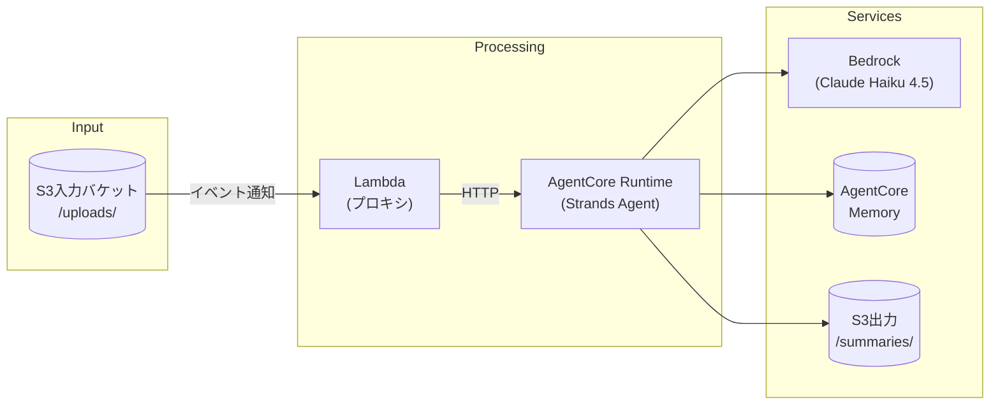

# S3イベント駆動 Strands Agents ドキュメント要約

S3にテキストファイルがアップロードされたら、AgentCore RuntimeでStrands Agentsが自動的に要約を生成し、AgentCoreMemoryに長期記憶として保存するサーバーレスアプリケーション。

## アーキテクチャ



## 特徴

- **過去の文脈を参照**: AgentCoreMemoryのセマンティック検索で関連する過去の事実を自動取得
- **事実抽出**: 要約から重要な事実を抽出し、長期記憶として保存
- **日本語対応**: コメント・ドキュメント・要約すべて日本語

## 前提条件

- Python 3.12+
- [uv](https://docs.astral.sh/uv/) (Pythonパッケージマネージャー)
- Docker
- AWS CLI (設定済み)
- Terraform 1.5+

## セットアップ

### 1. 依存関係のインストール

```bash
# uvで依存関係をインストール
uv sync
```

### 2. Terraform変数の設定

```bash
cd terraform

# サンプルをコピー
cp terraform.tfvars.example terraform.tfvars

# 必要に応じて設定を変更
vim terraform.tfvars
```

### 3. インフラのデプロイ

```bash
cd terraform

# 初期化
terraform init

# プラン確認（AgentCoreMemoryも自動作成されます）
terraform plan

# デプロイ
terraform apply
```

### 4. Dockerイメージのビルド＆プッシュ

```bash
# ECRにイメージをプッシュ
./scripts/build_and_push.sh
```

## 使用方法

### ファイルをアップロード

```bash
# テストファイルを作成
echo "これはテスト文書です。" > test.txt

# S3にアップロード
# 形式: s3://bucket/{user_id}/uploads/{filename}
aws s3 cp test.txt s3://YOUR_BUCKET/alice/uploads/test.txt
```

### 要約を確認

```bash
# 要約ファイルを取得
aws s3 cp s3://YOUR_BUCKET/alice/summaries/test.txt.summary.txt -
```

### ログを確認

```bash
# Lambdaログを確認
aws logs tail /aws/lambda/strands-doc-summarizer-dev-proxy --follow
```

## プロジェクト構成

```
agentcore_s3_event/
├── pyproject.toml              # uv プロジェクト定義
├── Dockerfile                  # AgentCore Runtime用
├── CLAUDE.md                   # コーディング規約
│
├── src/summarizer/             # メインアプリケーション
│   ├── app.py                  # AgentCore Runtimeエントリポイント
│   ├── agent.py                # Strands Agent定義
│   └── tools/
│       └── document_tools.py   # S3読み書きツール
│
├── lambda/
│   └── proxy_handler.py        # S3イベント→AgentCore Runtime転送
│
├── terraform/                  # インフラ定義
│   ├── main.tf
│   ├── variables.tf
│   ├── s3.tf
│   ├── lambda.tf
│   ├── ecr.tf
│   ├── agentcore_runtime.tf
│   ├── agentcore_memory.tf     # AgentCoreMemory + Strategy
│   ├── iam.tf
│   └── outputs.tf
│
└── scripts/
    ├── build_and_push.sh       # Docker build & ECR push
    └── package_lambda.sh       # Lambda ZIP作成
```

## S3キー構造

```
{user_id}/uploads/{filename}.txt      → 入力ファイル
{user_id}/summaries/{filename}.summary.txt  → 要約出力
```

## 対応ファイル形式

| 拡張子 | 説明 |
|--------|------|
| `.txt` | プレーンテキスト |
| `.md`  | Markdown |

## ユースケース例

### プロジェクト月次報告書

```
alice/uploads/project_report_2024_01.txt  → 要約 + 事実抽出
alice/uploads/project_report_2024_02.txt  → 過去の事実を参照して要約
```

**1月の報告書要約:**
> プロジェクトAの進捗率は45%、担当はBさん。課題としてリソース不足が挙げられている。

**2月の報告書要約（過去参照あり）:**
> プロジェクトAの進捗率は前月45%から70%に向上。1月に課題だったリソース不足は解消された模様。

## 設定パラメータ

| 変数名 | デフォルト | 説明 |
|--------|-----------|------|
| `aws_region` | `us-east-1` | AWSリージョン |
| `project_name` | `strands-doc-summarizer` | プロジェクト名 |
| `bedrock_model_id` | `us.anthropic.claude-3-5-haiku-20241022-v1:0` | Bedrockモデル |
| `lambda_timeout` | `30` | Lambdaタイムアウト（秒） |

## トラブルシューティング

### Lambda が AgentCore Runtime を呼び出せない

1. IAMロールの権限を確認
2. AgentCore Runtimeのステータスを確認:
   ```bash
   aws bedrock-agentcore-control get-agent-runtime --agent-runtime-id YOUR_ID
   ```

### 要約が生成されない

1. S3キーの形式を確認（`{user_id}/uploads/` 形式か）
2. ファイル拡張子を確認（`.txt` または `.md` か）
3. CloudWatch Logsでエラーを確認

### AgentCoreMemoryに接続できない

1. `terraform output agentcore_memory_id` でMemory IDを確認
2. IAMロールに`bedrock-agentcore:*`権限があるか確認
3. Memoryのステータスを確認:
   ```bash
   aws bedrock-agentcore get-memory --memory-id $(terraform output -raw agentcore_memory_id)
   ```

## 開発

### ローカルテスト

```bash
# 依存関係をインストール（開発用含む）
uv sync --all-extras

# テスト実行
uv run pytest

# リンター
uv run ruff check .

# フォーマッター
uv run ruff format .
```

### コーディング規約

`CLAUDE.md` を参照してください。主なポイント:

- コメント・docstringは日本語
- 変数名・関数名は英語（スネークケース）
- すべての関数に型ヒントを付ける

## ライセンス

MIT License
